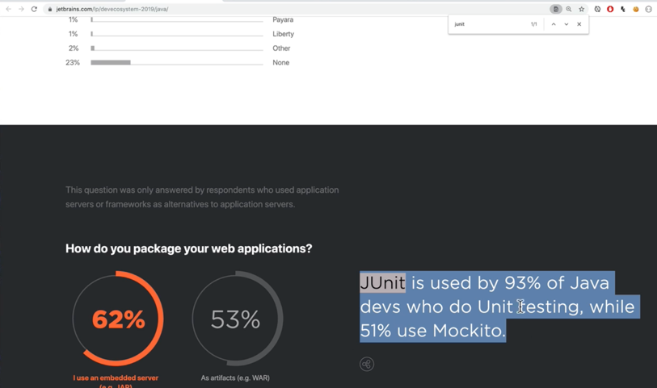
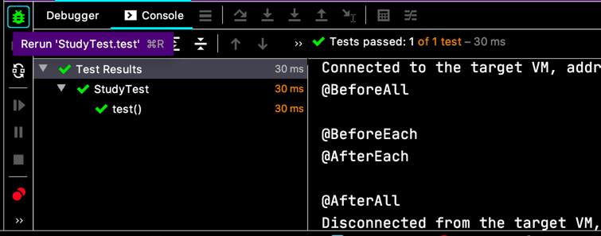
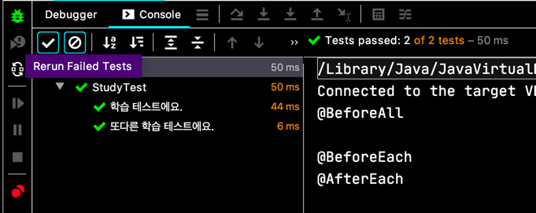

# 강의 자료
[https://github.com/keesun/inflearn-the-java-test](https://github.com/keesun/inflearn-the-java-test)  
public repository 니까 공유해도 상관 없겠죠?  
안된다고 하면 바로 ~~꼬리~~ 내릴게요.

# JUnit5 소개

```
+-------------+-----------+
|   Jupiter   |  Vintage  |
+-------------+-----------+
|      JUnit Platform     |
+-------------------------+
```
이런 모듈 스택으로 구성 된대요. (markdown table 써야지, 저렇게 그리려니까 힘ㄷ...)

- JUnit Platform: 테스트를 실행하는 launcher 제공
- Jupiter: Test Engine API 구현체. JUnit5 제공
- Vintage: JUnit 3,4 를 지원하는 Test Engine.

[https://junit.org/junit5/docs/current/user-guide/](https://junit.org/junit5/docs/current/user-guide/)
친절한 가이드. 이것만 보면 JUnit5 마스터! 😃

  
JUnit 은 java 개발자 93% 가 사용 중이래요. 대중적인 테스트 프레임웍이라고 보면 되겠네요.

```java
class AppTest {
  
  @Test
  void create() {
    App app = new App();
    assertNotNull(app);
  }
  
}
```
JUnit5 부터는 클래스와 테스트 메서드가 `public` 접근자가 아니라도 된대요.


```xml
<dependency>
  <groupId>org.junit.jupiter</groupId>
  <artifactId>junit-jupiter-engine</artifactId>
  <version>5.6.0</version>
  <scope>test</scope>
</dependency>
```

이런 의존성을 추가해주면 되는거죠.  
**spring-boot 2.2** 부터는 JUnit5 를 기본으로 가지고 있어서 따로 안해줘도 되고요.

```java
class StudyTest { 
  @Test
  void test() {
    Study study = new Study();
    
    assertNotNull(study);
  }
  
  @BeforeAll
  public static void setup() {
    System.out.println("@BeforeAll");
  }
  
  @AfterAll
  public static void cleanup() {
    System.out.println("@AfterAll");
  }
  
  @BeforeEach
  public void before() {
    System.out.println("@BeforeEach");
  }
  
  @AfterEach
  public void after() {
    System.out.println("@AfterEach");
  }
}
```



이렇게 테스트 Life Cycle 에 대응하는 애들도 있어요.

`@Disabled` 라는 건 테스트를 off 시켜요. 
```java
class StudyTest { 
  @Test
  @Diabled
  void test() {
    Study study = new Study();
    
    assertNotNull(study);
  }
  
  // ...
}
```

이러면 테스트가 실행되지 않아요.

테스트의 이름을 정하는 건데,
```java
class StudyTest {
  
  @Test
  @DisplayName("학습 테스트에요.")
  void test() {
    Study study = new Study();
    
    assertNotNull(study);
  }
  
  @Test
  @DisplayName("또다른 학습 테스트에요.")
  void test2() {
    Study study = new Study();
    
    assertNotNull(study);
  }
  
  // ...
}
```



이렇게 알아보기 좋은 이름으로 테스트가 나오기도 하네요!

