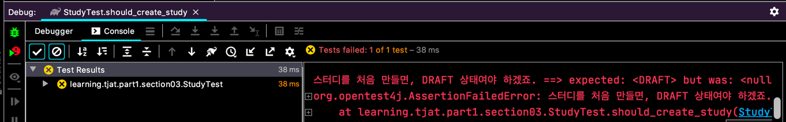
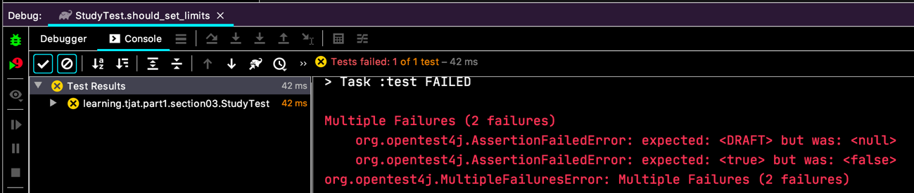

# Assertion
검증 내용을 확인할 때 쓰는 거죠.

Assertion 을 활용하기 위해서 테스트 시나리오를 만들어봐요.  
스터디 클래스를 만들고 진행상태를 넣어서 테스트를 하는거에요.
```java
public class Study {
  
  @Getter
  private StudyStatus status;
  
}

public enum StudyStatus {
  DRAFT,
  RUNNING,
  FINISH
}
``` 

스터디 클래스가 `status` 라는 상태 필드를 가지고 있어요.

```java
class StudyTest {
  @Test
  @DisplayName("스터디를 만들어요.")
  void should_create_study() {
    Study study = new Study();

    assertNotNull(study);
    assertEquals(StudyStatus.DRAFT, study.getStatus(),
        "스터디를 처음 만들면, DRAFT 상태여야 하겠죠.");
  }
}
```
`assertEquals` 와 같이 assertion 을 쓰고 마지막 파라미터로 메세지를 던질 수 있어요.  
  
예쁘게 설명이 나와요. 테스트를 만들고 한참 후에 다시 코드를 봤을 때나 한참 후에 어떤 부작용으로 테스트가 깨져서 다시 살펴볼 때, 유용하겠죠?!

```java
class StudyTest {
  // ...
  @Test
  @DisplayName("스터디를 만들어요. #2")
  void should_create_study_II() {
    final Study study = new Study();
    
    assertEquals(StudyStatus.DRAFT, study.getStatus(),
        () -> "스터디 처음 만들때 DRAFT 라고요!");
  }  
}
```
람다로 `Supplier` 를 넣을 수도 있어요.
`String` 으로 문자를 넣으면 코드가 컴파일 되면서 무조건 문자연산을 해야하는데, 람다를 쓰면 테스트가 깨질 때에만 문자연산이 실행되서 시스템 효율을 높일 수 있대요.
~~굳이 그렇게까지 신경써야 할까 싶기도 하고...~~

`assertTrue(...)`, `assertFalse(...)` ... 등등 있어요.

```java
class StudyTest {
  // ...

  @Test
  @DisplayName("스터디 정원을 설정해요.")
  void should_set_limits() {
    final Study study = new Study(-10);
    
    assertAll(
        () -> assertEquals(StudyStatus.DRAFT, study.getStatus()),
        () -> assertTrue(study.getLimit() > 0)
    );
  }
}
```
만약 이런 테스트가 있으면, 2개의 assertion 이 있는데 첫번째에서 깨지니깐 2번째는 확인도 못해보게 돼요.
그래서 하나가 깨져도 마저 테스트를 실행해주는게 있죠.  
  
`2 failures` 라고 나오죠.

```java
class Study {
  private final int limit;
  
  public Study(final int limit) {
    if (limit < 0) {
      throw new IllegalArgumentException("greater then zero.");  
    }
    
    this.limit = limit;
  }

  // ...
}
```
이렇게 정원을 정해서 클래스 인스턴스를 만들게 하고,
```java
class StudyTest {
  // ...
  @Test
  @DisplayName("스터디 정원을 설정해요.#2")
  void should_set_limits_II() {
    
    assertThrows(IllegalArgumentException.class,
        () -> new Study(-10));
    
  }
}
```
이렇게 예외를 받는 테스트도 할 수 있어요. JUnit4 보다 더 편해진 것 같네요!


