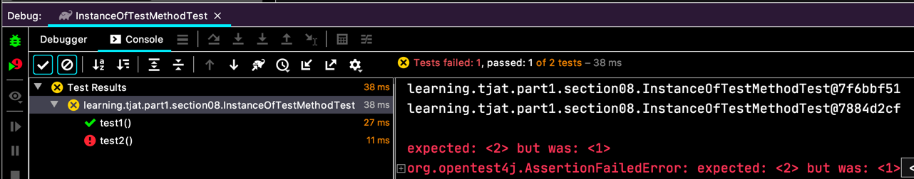
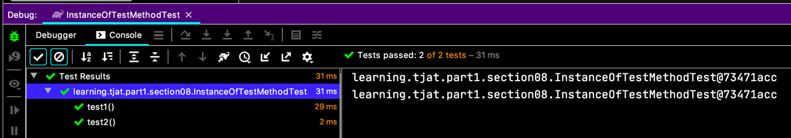
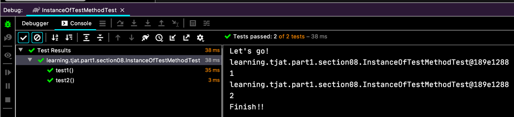
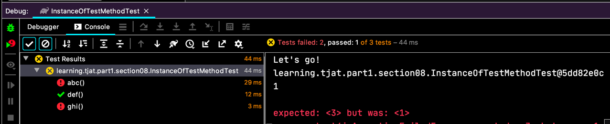
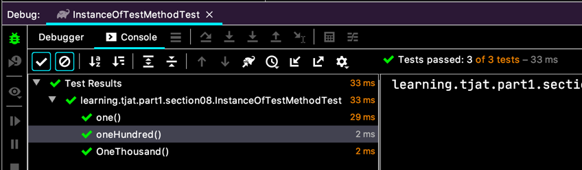
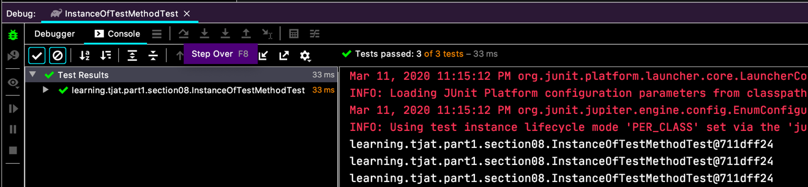
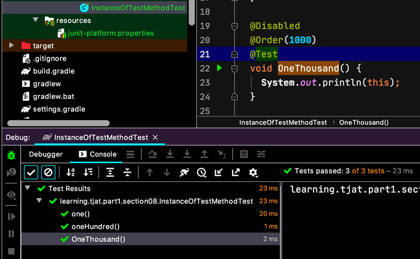
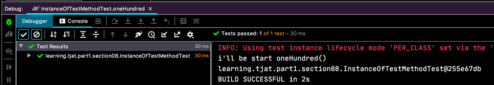

# 테스트 인스턴스

우리의 테스트는 하나의 클래스 내에 여러 메서드로 진행이 되는데요.
사실은 하나의 테스트 메서드를 실행시킬 때마다 클래스 객체 인스턴스를 새로 생성해서 진행을 한대요.

```java
class InstanceOfTestMethodTest { 
  private int count = 0;
  
  @Test
  void test1() {
    System.out.println(this);
    count++;
    assertEquals(1, count);
  }
  
  @Test
  void test2() {
    System.out.println(this);
    count++;
    assertEquals(2, count);
  }
}
```
이렇게 코드를 작성하면, 실패하는 이유가 그것이죠.
  
콘솔에 출력한 객체 해시코드도 다르고.

하물며, 테스트 메서드 들의 실행 순서도 일관성이 없다고 해요.

이걸 바꿀 수 있어요.  
`@TestInstance(TestInstance.Lifecycle.PER_CLASS)` 를 쓰는데요.

  
테스트도 성공하고 객체 해시코드도 같죠.

그리고 `@BeforeAll` 이나 `@AfterAll` 도 더이상은 `static` 일 이유가 없어요. 당연히 빼도 되는거죠.

```java
@TestInstance(TestInstance.Lifecycle.PER_CLASS)
class InstanceOfTestMethodTest {
  
  private int count = 0;
  
  @BeforeAll
  /*static*/ void setup() {
    System.out.println("Let's go!");
  }
  
  @AfterAll
  /*static*/ void teardown() {
    System.out.println("Finish!!");
  }
  
  @BeforeEach
  void start() {
    count++;
  }
  
  @AfterEach
  void end() {
    System.out.println(count);
  }
  
  @Test
  void test1() {
    System.out.println(this);
    assertEquals(1, count);
  }
  
  @Test
  void test2() {
    System.out.println(this);
    assertEquals(2, count);
  }
}
```

  

# 테스트 순서
`@TestMethodOrder(...)` 를 이용하면 테스트를 실행하는 순서를 조율할 수 있어요.  
예를들어, 시나리오 대로 테스트를 하거나, UseCase 가 있는 테스트는 진행 순서를 맞춰야 할 필요가 있는데, 그럴 때, 쓸만하겠죠.

`@TestMethodOrder(MethodOrderer.Alphanumeric.class)` 는 테스트 메서드의 이름으로 정렬해서 실행 순서를 정해요.
```java
@TestInstance(TestInstance.Lifecycle.PER_CLASS)
@TestMethodOrder(MethodOrderer.Alphanumeric.class)
class InstanceOfTestMethodTest {
  
  private int count = 0;
  
  @BeforeAll
  /*static*/ void setup() {
    System.out.println("Let's go!");
  }
  
  @AfterAll
  /*static*/ void teardown() {
    System.out.println("Finish!!");
  }
  
  @BeforeEach
  void start() {
    count++;
  }
  
  @AfterEach
  void end() {
    System.out.println(count);
  }
  
  @Test
  void ghi() {
    System.out.println(this);
    assertEquals(1, count);
  }
  
  @Test
  void def() {
    System.out.println(this);
    assertEquals(2, count);
  }
  
  @Test
  void abc() {
    System.out.println(this);
    assertEquals(3, count);
  }
}
``` 
  

순서를 임의로 정할 수도 있죠.
```java
@TestMethodOrder(MethodOrderer.OrderAnnotation.class)
class InstanceOfTestMethodTest {
  @Order(100)
  @Test
  void oneHundred() {
    System.out.println(this);
  }
  
  @Order(1000)
  @Test
  void OneThousand() {
    System.out.println(this);
  }
  
  @Order(1)
  @Test
  void one() {
    System.out.println(this);
  }
}
```
  

# junit-platform.properties
이런게 있네요. 전체적인 설정 적용.
- `junit.jupiter.testinstance.lifecycle.default`
    - **per_class**: 인스턴스 모드로 실행  
      

- `junit.jupiter.conditions.deactivate`
    - **org.junit.*DisabledCondition**: 저런 패키지 형식으로 차단된 것들을 무효화하고 테스트를 실행해줘요.
        
      
다양한 기능이 있는데, 다 나열하기 보다는 필요한 부분이 있을 때, 공식문서를 참고하시면 될 것 같더군요.
[https://junit.org/junit5/docs/current/user-guide/](https://junit.org/junit5/docs/current/user-guide/)

# 확장 모델

테스트를 시작하기 전이나 후에 실행을 추가하는 건데, interceptor 라고 볼 수도 있을 것 같고...
아니면 경량의 Store 같은 걸로 볼 수도 있을 것 같아요.

```java
public class SomeTestExtension implements BeforeTestExecutionCallback {
  @Override
  public void beforeTestExecution(ExtensionContext context) throws Exception {
    System.out.printf("i'll be start %s \n", context.getDisplayName());
  }
}
```
`BeforeTestExecutionCallback` 의 `beforeTestExecution(...)` 에서 구현 내용을 작성하면 되는데요.  
`ExtensionContext` 가 진행되는 테스트의 기본 정보들을 모두 담고 있어요.
`AfterTestExecutionCallback` 도 구현하면 되는데, `ExtensionContext` 가 가진 `Store` 를 이용해서 Before 에서 값을 저장하고, After 에서 꺼내 쓸 수도 있더라고요.

Extension 은
```java
@ExtendWith(SomeTestExtension.class)
@TestMethodOrder(MethodOrderer.OrderAnnotation.class)
class InstanceOfTestMethodTest {
  // ...
}  
``` 
`@ExtendWith(SomeTestExtension.class)` 이렇게 등록해서 사용할 수 도 있고,

```java
@TestMethodOrder(MethodOrderer.OrderAnnotation.class)
class InstanceOfTestMethodTest {
  @RegisterExtension
  SomeTestExtension someTestExtension
      = new SomeTestExtension();

  // ...
}
``` 
`@RegisterExtension` 를 활용해서 등록해서 사용할 수도 있어요. (`private` 접근자는 안돼요!)  
Extension 이 인스턴스 생성자로 주입할 값이 있거나 하면 이걸 써야겠네요.




# Migration
음... `junit-vintage-engine` 의존성이 추가되면 JUnit3, 4 버전으로 작성된 테스트도 한꺼번에 작동이 가능하다는 거에요.
별로 할말은 없네요. 이전 버전의 테스트를 쉽게 JUnit 5 로 변경할 수 있다는 조언 정도~
