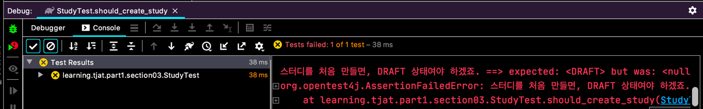
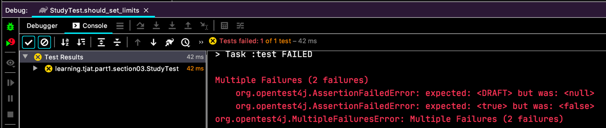
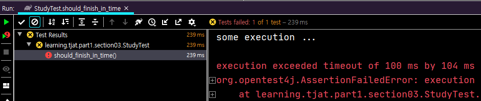
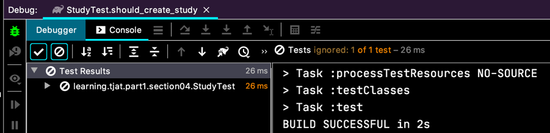
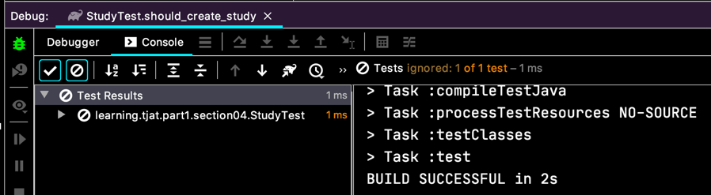
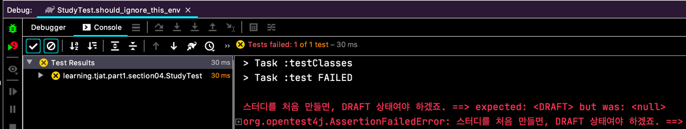
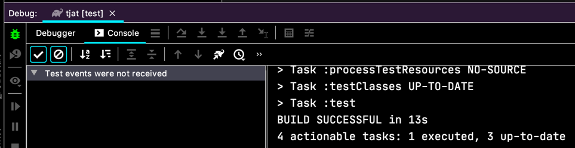
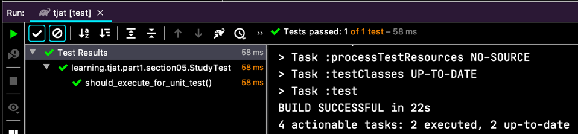

# Assertion
검증 내용을 확인할 때 쓰는 거죠.

Assertion 을 활용하기 위해서 테스트 시나리오를 만들어봐요.  
스터디 클래스를 만들고 진행상태를 넣어서 테스트를 하는거에요.
```java
public class Study {
  
  @Getter
  private StudyStatus status;
  
}

public enum StudyStatus {
  DRAFT,
  RUNNING,
  FINISH
}
``` 

스터디 클래스가 `status` 라는 상태 필드를 가지고 있어요.

```java
class StudyTest {
  @Test
  @DisplayName("스터디를 만들어요.")
  void should_create_study() {
    Study study = new Study();

    assertNotNull(study);
    assertEquals(StudyStatus.DRAFT, study.getStatus(),
        "스터디를 처음 만들면, DRAFT 상태여야 하겠죠.");
  }
}
```
`assertEquals` 와 같이 assertion 을 쓰고 마지막 파라미터로 메세지를 던질 수 있어요.  
  
예쁘게 설명이 나와요. 테스트를 만들고 한참 후에 다시 코드를 봤을 때나 한참 후에 어떤 부작용으로 테스트가 깨져서 다시 살펴볼 때, 유용하겠죠?!

```java
class StudyTest {
  // ...
  @Test
  @DisplayName("스터디를 만들어요. #2")
  void should_create_study_II() {
    final Study study = new Study();
    
    assertEquals(StudyStatus.DRAFT, study.getStatus(),
        () -> "스터디 처음 만들때 DRAFT 라고요!");
  }  
}
```
람다로 `Supplier` 를 넣을 수도 있어요.
`String` 으로 문자를 넣으면 코드가 컴파일 되면서 무조건 문자연산을 해야하는데, 람다를 쓰면 테스트가 깨질 때에만 문자연산이 실행되서 시스템 효율을 높일 수 있대요.
~~굳이 그렇게까지 신경써야 할까 싶기도 하고...~~

`assertTrue(...)`, `assertFalse(...)` ... 등등 있어요.

```java
class StudyTest {
  // ...

  @Test
  @DisplayName("스터디 정원을 설정해요.")
  void should_set_limits() {
    final Study study = new Study(-10);
    
    assertAll(
        () -> assertEquals(StudyStatus.DRAFT, study.getStatus()),
        () -> assertTrue(study.getLimit() > 0)
    );
  }
}
```
만약 이런 테스트가 있으면, 2개의 assertion 이 있는데 첫번째에서 깨지니깐 2번째는 확인도 못해보게 돼요.
그래서 하나가 깨져도 마저 테스트를 실행해주는게 있죠.  
  
`2 failures` 라고 나오죠.

```java
class Study {
  private final int limit;
  
  public Study(final int limit) {
    if (limit < 0) {
      throw new IllegalArgumentException("greater then zero.");  
    }
    
    this.limit = limit;
  }

  // ...
}
```
이렇게 정원을 정해서 클래스 인스턴스를 만들게 하고,
```java
class StudyTest {
  // ...
  @Test
  @DisplayName("스터디 정원을 설정해요.#2")
  void should_set_limits_II() {
    
    assertThrows(IllegalArgumentException.class,
        () -> new Study(-10));
    
  }
}
```
이렇게 예외를 받는 테스트도 할 수 있어요. JUnit4 보다 더 편해진 것 같네요!

```java
class StudyTest {
  // ...
  @Test
  @DisplayName("timeout 내에 처리가 되어야해요.")
  void should_finish_in_time() {
    assertTimeout(Duration.ofMillis(100), () -> {
      System.out.println("some execution ...");
      TimeUnit.MILLISECONDS.sleep(200);
    });
  } 
}
```
이렇게 실행하면
  
이렇게 100ms 내에 끝나야하는데, 300ms 를 지연시켜서 시간이 초과했다고 오류가 나요.
 
```java
  @Test
  @DisplayName("timeout 내에 처리가 되어야해요.")
  void should_finish_in_time_preemptively() {
    assertTimeoutPreemptively(Duration.ofMillis(100), () -> {
      System.out.println("some execution ...");
      TimeUnit.MILLISECONDS.sleep(200);
    });
  }
```
비슷한데, 이런식으로 preemptively (선제, 선취, 우선순위) 하게 할 수 있는데, timeout 에 우선 순위를 둬서,
테스트 코드를 끝까지 처리하지 못해도 제한된 시간이 지나면 그냥 끝내버리는 거고.
`assertTimeout(...)` 은 그래도 테스트 실행을 끝까지 지켜본다는 차이가 있어요. `assertTimeoutPreemptively(...)` 는 `ThreadLocal` 같은 테스트에는 적합하지 않대요.
아마도 제한된 시간이 지나면 thread 를 죽이는데, `ThreadLocal` 을 이용하면 참조된 메모리 때문에 thread 가 죽질 않아서 그런게 아닐까 싶긴 하네요.
(테스트는 안해 봄;;;)

# 조건에 따라 테스트 실행하기

System property 등등 환경적 요인을 기준으로 테스트를 실행 할지 말지를 결정하는 게 있어요.
`Assumptions` 클래스의 메소드를 이용하면 돼요. 

```java
  @Test
  @DisplayName("assumptions")
  void should_ignore_this_os() {
    final String ANDROMEDA = "Andromeda";

    System.setProperty("OS", ANDROMEDA);
    assumeTrue(ANDROMEDA.equals(System.getProperty("OS")));
    
    Study study = new Study();
    
    assertNotNull(study);
    assertEquals(StudyStatus.DRAFT, study.getStatus(),
        "스터디를 처음 만들면, DRAFT 상태여야 하겠죠.");
  }
```
  
그림처럼 테스트 결과는 성공이라고 나오고, 테스트가 아예 실행되지 않았어요.

```java
  @Test
  @DisplayName("assumptions")
  @EnabledOnJre({JRE.JAVA_8, JRE.JAVA_9})
  void should_ignore_this_test() {
    Study study = new Study();
    
    assertNotNull(study);
    assertEquals(StudyStatus.DRAFT, study.getStatus(),
        "스터디를 처음 만들면, DRAFT 상태여야 하겠죠.");
  }
```
저는 지금 openjdk 11 에서 실행하고 있으니깐 해당 테스트 결과는..
  
역시 테스트가 ignored 됐어요.

```java
  @Test
  @DisplayName("assumptions #3")
  @EnabledIfEnvironmentVariable(named = "HOME", matches = "(/\\w+)+")
  void should_ignore_this_env() {
    Study study = new Study();
    
    assertNotNull(study);
    assertEquals(StudyStatus.DRAFT, study.getStatus(),
        "스터디를 처음 만들면, DRAFT 상태여야 하겠죠.");
  }
```
`@EnabledIfEnvironmentVariable` 는 환경변수에 따라 결정하는데, 정규표현식으로 확인을 해요.
제가 지금 `HOME` 이라는 환경변수가 `/Users/green` 이니까, match 가 돼서 테스트가 실행되고 결과는 실패라고 나왔어요.
  


# Tagging And Filtering

테스트에 tag 를 달아서 특정 tag 만 실행 할 수 있어요.

```java
@Tag("all-for-test")
class StudyTest {
  @Test
  @DisplayName("tagging test")
  @Tag("for-unit-test")
  void should_execute_for_unit_test() {
    Study study = new Study();
    assertNotNull(study);
  }
  
  @Test
  @DisplayName("tagging test")
  @Tag("for-TDD")
  void should_execute_for_tdd() {
    Study study = new Study();
    assertEquals(StudyStatus.DRAFT, study.getStatus(),
        "스터디를 처음 만들면, DRAFT 상태여야 하겠죠.");
  } 
}
```
`@Tag` 는 `@Target({ ElementType.TYPE, ElementType.METHOD })` 이렇게 사용할 수 있어요.

이렇게 하고 gradle 을 이용한다면
```gradle
// build.gradle
test {
    useJUnitPlatform {
        includeTags 'for-unit-test'
        excludeTags 'all-for-test'
    }
}
```
이렇게 하면, 
  
이렇게 되고
```gradle
// build.gradle
test {
    useJUnitPlatform {
        includeTags 'for-unit-test'
        // excludeTags 'all-for-test'
    }
}
```
이렇게 하면,
  
`includeTags 'for-unit-test'` 에 맞는 `@Tag` 의 테스트 들이 실행 되는 거죠.

