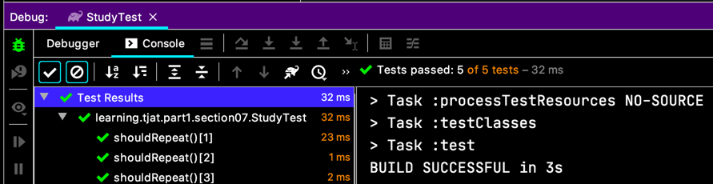
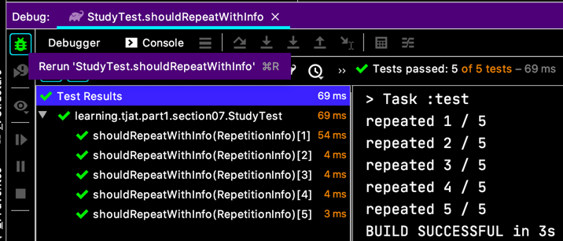
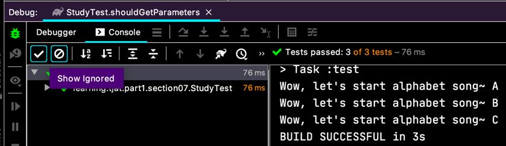
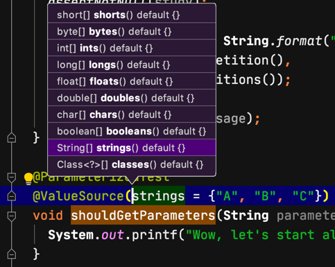
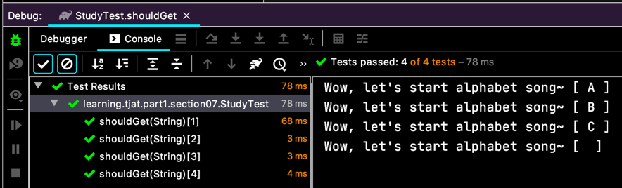
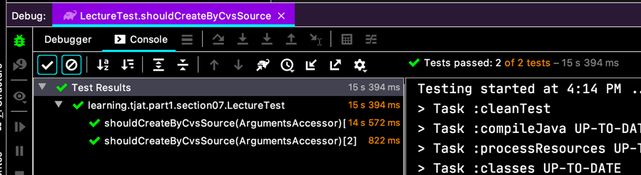
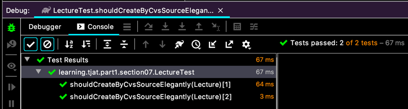

# 커스텀 태그

이전에 `@Tag` 에 대해서 봤잖아요. 근데 단점이 태그 내용을 `@Tag("샬랴쏼롸")` 이런식으로 넣다보니까 오타가 날 수 있잖아요.
그래서 커스텀하게 진행할 수 있어요.

```java
@Target(ElementType.METHOD)
@Retention(RetentionPolicy.RUNTIME)
@Test
@Tag("for-unit-test")
public @interface ForUnitTest {
}

@Target(ElementType.METHOD)
@Retention(RetentionPolicy.RUNTIME)
@Test
@Tag("for-TDD")
public @interface ForTDDTest {
}
```
이렇게 어노테이션을 만들고,
```java
class StudyTest {
  
  @ForUnitTest
  @DisplayName("tagging test")
  void should_execute_for_unit_test() {
    Study study = new Study();
    assertNotNull(study);
  }
  
  @ForTDDTest
  @DisplayName("tagging test")
  void should_execute_for_tdd() {
    Study study = new Study();
    assertEquals(StudyStatus.DRAFT, study.getStatus(),
        "스터디를 처음 만들면, DRAFT 상태여야 하겠죠.");
  }
  
}
```
이렇게 쓸 수 있어요. 이거 좋은것 같아요.

# 테스트 반복하기
여러번 반복해서 실행해야할 경우가 있으니까
`@RepeatedTest(반복횟수)` 를 이용해서 테스트 할 수 있어요.
```java
class StudyTest {
  
  @RepeatedTest(5)
  void shouldRepeat() {
    Study study = new Study();
    assertNotNull(study);    
  }
 
}
```
이렇게 실행하면,  
  
배열처럼 저렇게 신기하게 나오네요.

이뿐만 아니라 저 테스트 메서드의 인자로 `RepetitionInfo` 객체를 받을 수 있어요.

```java
class StudyTest {
  @RepeatedTest(5)
  void shouldRepeatWithInfo(RepetitionInfo info) {
    Study study = new Study();
    assertNotNull(study);
  
    final String message = String.format("repeated %d / %d",
        info.getCurrentRepetition(),
        info.getTotalRepetitions());
   
    System.out.println(message);
  }
}
```
이렇게 하면,
  
이렇게 실행 순번을 받아서 테스트를 할 수도 있네요.
유용할 것 같아요~!


이처럼 순차적인 번호로의 파라미터 말고, 임의의 파라미터를 가지고 테스트 할 때는,
`@ParameterizedTest` 를 쓰면 돼요.

```java
class StudyTest {
  @ParameterizedTest
  @ValueSource(strings = {"A", "B", "C"})
  void shouldGetParameters(String parameter) {
    System.out.printf("Wow, let's start alphabet song~ %s \n", parameter);
  }
}
```
이러면,
  
이렇게 여러가지 경우의 수를 등록해두고 쓸 수도 있겠어요.

  
`@ValueSource` 가 가지는 속성들이에요. 뭔가 아쉽지만...  

하지만, 그래서~ `@ConvertWith(...)` 가 있어요. 
여기 대충 만든건 아니군요.

```java
class StudyTest {
  @DisplayName("파라미터를 가진 테스트들...")
  @ParameterizedTest(name = "{index}: {displayName}")
  @ValueSource(strings = {"A", "B", "C"})
  @EmptySource
  void shouldGet(@ConvertWith(ABCSongConverter.class) String parameter) {
    System.out.printf("Wow, let's start alphabet song~ %s \n", parameter);
  }

  // 처음엔 `static` 없이 했는데, 역시나 안되더라고요;;
  static class ABCSongConverter extends SimpleArgumentConverter {
    @Override
    protected Object convert(Object source, Class<?> targetType) throws ArgumentConversionException {
      return "[ " + source.toString() + " ]";
    }
  }

}
```

  


이제 한걸음 더 나아가 봐요.
이런 걸로도 뭔가 부족하가 하시면
```java
public class LectureTest { 
  @Test
  void shouldCreateLecture() {
    final Lecture lecture = new Lecture("TDD", 34);
  }

  @ParameterizedTest
  @CsvSource({"'Test Driven Development1', 11", "JUnit5, 13"})
  void shouldCreateByCvsSource(ArgumentsAccessor accessor) {
    final Lecture lecture = new Lecture(
        accessor.getString(0),
        accessor.getInteger(1));
    
    assertNotNull(lecture);
  }
}
```

`@CsvSource` 는 CSV(Comma Separated Values) 형식으로 입력된 값을 테스트에 넘겨주는 역할을 하고요.  
테스트 메서드의 파라미터로 정의된 `ArgumentsAccessor` 클래스.
그리고, 그것의 인스턴스가 가진 메서드 `.getString(...)`, `.getInteger(...)` 로 CSV 값을 받을 수 있어요.

  
잘 되네요.

조금 더 세련되게 접근해볼까요?  
Spring 의 `ArgumentResolver` 처럼 동작하는 걸 해볼거에요.
```java
class LectureTest {
  @ParameterizedTest
  @CsvSource({"'Test Driven Development1', 11", "JUnit5, 13"})
  void shouldCreateByCvsSourceElegantly(
      @AggregateWith(LectureAggregator.class) Lecture lecture) {
    
    assertNotNull(lecture);
  }
  
  static class LectureAggregator implements ArgumentsAggregator {
    @Override
    public Object aggregateArguments(ArgumentsAccessor accessor, ParameterContext context) throws ArgumentsAggregationException {
      final String lectureName = accessor.getString(0);
      final Integer lectureChapter = accessor.getInteger(1);
      
      return new Lecture(lectureName, lectureChapter);
    }
  }  
}
```

`class LectureAggregator implements ArgumentsAggregator` 를 먼저 만들어줘요.
그럼 그걸 이용해서 `@AggregateWith(...)` 를 해주고요.

말해 뭐하겠나마는
  
잘 실행이 됐죠.

> `@ParameterizedTest(name = " ... {displayName} {index}")`
> 이렇게 하면 테스트 이름이 바뀐다고 설명이 됐는데,
> 그게 잘 안되네요.
> 현재 JUnit 빌드버전이 강의에 나온 내용이랑 달라서 그런것 같기도 해요.
> 제 성격에 나중에 다시 이걸 업데이트 할 것 같진 않고...
> 그냥 빌드 버전 올라가면 될 것 같으니깐, 그 때 차차 경험해 보기로 하고 끝!

