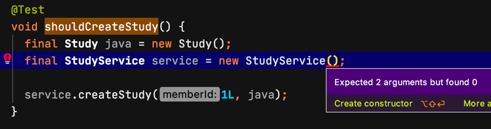
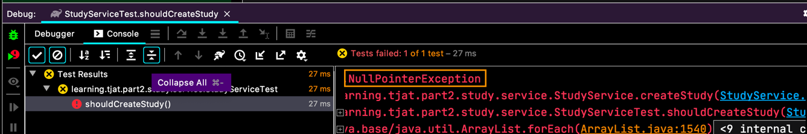
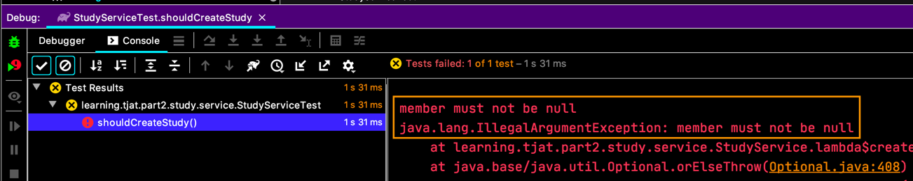
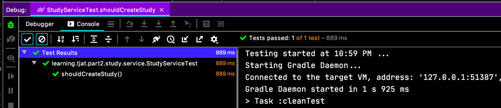

# Mockito

> JUnit is used by 93% of Java devs who do Unit testing, while 51% use Mockito.
> - [Jetbrains devecosystem-2019](https://www.jetbrains.com/lp/devecosystem-2019/java/)

상당히 많이 이용하죠? 저도 억지로 테스트 커버리지 맞추면서 써보곤 했었죠.  
강사님도 굳이 모든 것들을 Mocking 하고 테스트 할 필욘 없다고 말씀하세요. [마틴파울러 옹 께서도 비슷한 의견](https://martinfowler.com/bliki/UnitTest.html)이신가 봐요.

# Mockito 시작하기

spring-boot 2.2 에는 기본적으로 의존하고 있대요.
```xml
<dependency>
  <groupId>org.springframework.boot</groupId>
  <artifactId>spring-boot-starter-test</artifactId>
  <scope>test</scope>
</dependency>
```    
이렇게 기본 적으로 들어 있고요.
```
Gradle: org.mockito:mockito-core:3.1.0
Gradle: org.mockito:mockito-junit-jupiter:3.1.0
```
그래이들에서 이렇게 의존성이 참조되고요.

[Java Doc API](https://javadoc.io/doc/org.mockito/mockito-core) 도 있는데, 전 별로 도움 안되는 것 같아요. Java doc... 

# Mockito 객체 만들기

자! 시작해 볼까요?!
```java
@Entity
class Member {
  @Id
  private Long memberId;
}

@Entity
class Study {
  @Id
  private Long id;

  @ManyToOne
  @Setter
  private Member owner;
}
```
그냥 2개 Entity 를 만들고..
```java
interface MemberService {
  Member getMemberById(Long memberId);
}

interface StudyRepository extends JpaRepository<Study, Long> {
}
```
이렇게 구현되지 않은 상태이고,
```java
@RequiredArgsConstructor
class StudyService {
  private final MemberService memberService;
  private final StudyRepository studyRepository;

  public Study createStudy(Long memberId, Study study) {
    Optional<Member> member = memberService.getMemberById(memberId);

    study.setOwner(
        member.orElseThrow(()
            -> new IllegalArgumentException("member must not be null"))
    );

    return studyRepository.save(study);
  }
}
```
이렇게 서비스가 있다면, 테스트를 어떻게 만들까요?  
일단 만들어봐요.

```java
class StudyServiceTest {
  
  @Test
  void shouldCreateStudy() {
    final Study java = new Study();
    final StudyService service = new StudyService();
    
    service.createStudy(1L, java);
  }
  
}
```
바로 컴파일 에러죠.  
  

이런 상황에 Mockito 를 쓰는거죠.  
이제 `@Mock` 을 넣어요.
```java
class StudyServiceTest {
 
  @Mock
  private MemberService memberService;
  
  @Mock
  private StudyRepository studyRepository;
  
  @Test
  void shouldCreateStudy() {
    final Study java = new Study();
    final StudyService service = new StudyService(
        memberService, studyRepository);
    
    service.createStudy(1L, java);
  }
  
}
```

  
하지만 NPE. 아하 Mockito extension 을 넣어줘야 한대요.  

```java
@ExtendWith(MockitoExtension.class)
class StudyServiceTest {
  // ...
}
```
`@ExtendWith(...)` 로 JUnit5 에서는 확장을 할 수 있다고 했었잖아요. `MockitoExtension.class` 를 넘겨서 실행해보지만...  
  
실패.

어쩌면 당연하죠.
기본 Stub 객체만 있고, 구현된게 아닌데... 될 리가 없죠.

# Mock 객체 Stubbing

모든 Mock 객체는 이렇게 된대요.
 - Null 을 되돌려주고,
 - 비어있는 `Optional` 은 `Optional.empty` 를 되돌려주고,
 - Primitive type 은 기본 값. (false, 0)
 - Collection 객체는 비어있는 Collection
 
이 나오게 되어 있대요.

음... 그렇게 이해하고 하던 테스트로 되돌아 가서, 실제로 Stubbing 을 해봐요.
```java
class StudyServiceTest {
  @Test
  void shouldCreateStudy() {
    
    final Study java = new Study();
    final StudyService service = new StudyService(
        memberService, studyRepository);

    // mock 이 stubbing 해서 되돌려줄거라고 예상하는 객체  
    final Optional<Member> member =
        Optional.of(Member.builder()
            .memberId(1L)
            .email("tester@test.com")
            .age(120).build());
    
    // memberService 의 getMemberById 를 호출 한다고 가정할 때,
    when(memberService.getMemberById(1L))
    // 그러면 되돌려주는 게 member 가 된다는 구어체에 가까운 메서드 체이닝의 우아함.
        .thenReturn(member);
    
    service.createStudy(1L, java);
  }
}
```

헥헥, 성공!  
  

테스트에 `when(...)` 하고 `thenReturn(...)` 만 섰는데, 다양한 matcher 와 then 이 있다고 해요.
[mockito javadoc](https://javadoc.io/static/org.mockito/mockito-core/3.3.3/index.html) 에서 다양한 예제를 만날 수 있네요.

