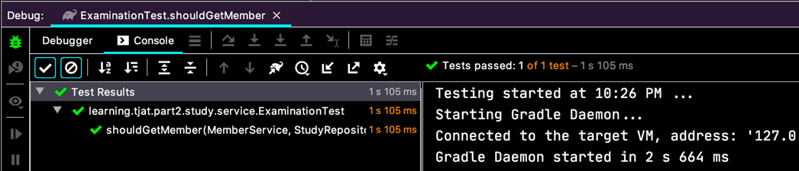
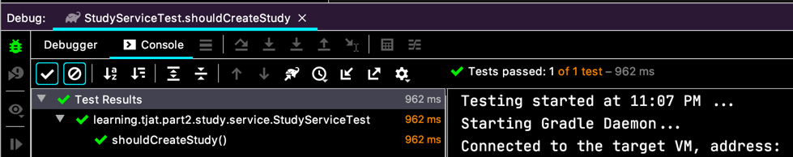
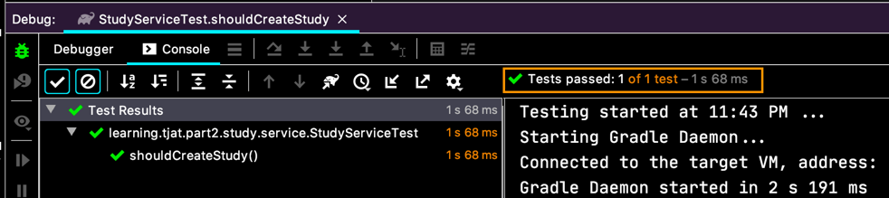
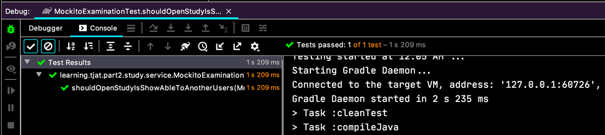

# Mock 객체 Stubbing 연습 문제

다음 코드의 // TODO에 해당하는 작업을 코딩으로 채워 넣으세요.
```java
Study study = new Study(10, "테스트");

// TODO 1. memberService 객체에 findById 메소드를 1L 값으로 호출하면 Optional.of(member) 객체를 리턴하도록 Stubbing
// TODO 2. studyRepository 객체에 save 메소드를 study 객체로 호출하면 study 객체 그대로 리턴하도록 Stubbing

studyService.createNewStudy(1L, study);

assertNotNull(study.getOwner());
assertEquals(member, study.getOwner());
```
TODO 로 지문을 풀어보면요,
```java
@ExtendWith(MockitoExtension.class)
class ExaminationTest {
  
  @Test
  void shouldGetMember(
      @Mock MemberService memberService,
      @Mock StudyRepository studyRepository) {

    final Member member = Member.builder()
        .memberId(1L)
        .age(120)
        .email("tester@test.com")
        .build();
    
    final Study study = Study.builder()
        .id(123L)
        .owner(member)
        .build();

    when(memberService.getMemberById(1L))
        .thenReturn(Optional.of(member));
  
    when(studyRepository.save(study))
        .thenReturn(study);
  
    final StudyService studyService = new StudyService(
        memberService,
        studyRepository);
  
    final Study created = studyService.createStudy(1L, study);
    assertEquals(1L, created.getOwner().getMemberId());
    
  }

}
```

  
이렇게 끝!

# Mock 객체 확인

Mock 객체를 verifying 하는 방법을 확인해 보는 거에요.
예를 들면,
```java
interface MemberService {

  Optional<Member> getMemberById(Long memberId);
  
  void notify(Study study);

}

class StudyService {
  // ...
  public Study createStudy(Long memberId, Study study) {
    Optional<Member> member = memberService.getMemberById(memberId);
    
    study.setOwner(
      member.orElseThrow(()
          -> new IllegalArgumentException("member must not be null"))
    );
    
    memberService.notify();
  
    return studyRepository.save(study);
  }              
}
```

`memberService.notify()` 이렇게 새로운 메서드를 추가 하고 이 메서드가 호출이 되었는지 아닌지를 확인해 보는 거에요.

```java
@ExtendWith(MockitoExtension.class)
class StudyServiceTest {
 
  @Mock
  private MemberService memberService;
  
  @Mock
  private StudyRepository studyRepository;
  
  @Test
  void shouldCreateStudy() {
    final StudyService service = new StudyService(
        memberService, studyRepository);
  
    final Optional<Member> member =
        Optional.of(Member.builder()
            .memberId(1L)
            .email("tester@test.com")
            .age(120).build());
    
    when(memberService.getMemberById(1L))
        .thenReturn(member);
  
    final Study usingTestInJava = new Study();
    final Study study = service.createStudy(1L, usingTestInJava);
    
    verify(memberService, times(1)).notify(study);

  }

```

`verify(memberService, times(1)).notify(study);` 이렇게요. 한번 호출 됩니다!

  

추가적으로 

`verify(memberService, never()).validate(any());` 전혀 호출 되지 않았다 라는 것도 `never()` 를 써서 사용할 수 있어요.

더 나아가서 `InOrder` 를 이용해서 어떤 순서로 실행됐는지 확인하는 것도 있어요.

```java
InOrder ordered = inOrder(memberService);
ordered.verify(memberService).notify(member);
ordered.verify(memberService).validate(any());
```

이런식으로 순서대로 호출됐는지 확인하는 것도 있죠.

`timeout(...)` 으로 시간내에 실행됐는지 확인하는 것과,  
`verifyNoMoreInteractions(...)` 로 특정 메서드까지만 실행되고, 더이상 어떤 행위도 안했는지 확인하는 것도 있어요.

# BDD 스타일 Mockito API
BDD;Behavior Driven Development 는 애플리케이션이 어떻게 행동하느냐를 기준으로 개발하는 일종의 개발 방법론 또는 정책 같은 거에요.
광범위하고 복잡한 방법론이지만 간단히 요약하면 Given / When / Then 으로 나눠서 행위의 정당성(?)을 확인하는 거죠.

우리 기존 코드를 BDD 스타일로 바꾼다면,
```java
    given/*when*/(memberService.getMemberById(1L))
        .willReturn/*thenReturn*/(member);
    given/*when*/(studyRepository.save(usingTestInJava))
        .willReturn/*thenReturn*/(usingTestInJava);
```  
`when(...).thenReturn(...)` 이랬던게,  
`given(...).willReturn(...)` 이렇게 바껴요.

BDD 에서 **Given** 을 표현하는 메서드로 바뀐거죠.  
그리고,  
`verify(memberService, times(1)).notify(study);` 이랬던 건,
`then(memberService).should(times(1)).notify(study);` 이렇게 되죠.  
전체적인 코드를 보자면,

```java
@ExtendWith(MockitoExtension.class)
class StudyServiceTest {
 
  @Mock
  private MemberService memberService;
  
  @Mock
  private StudyRepository studyRepository;
  
  @Test
  void shouldCreateStudy() {
    final StudyService service = new StudyService(
        memberService, studyRepository);
  
    final Optional<Member> member =
        Optional.of(Member.builder()
            .memberId(1L)
            .email("tester@test.com")
            .age(120).build());
  
    final Study usingTestInJava = new Study();
  
    // GIVEN
    given/*when*/(memberService.getMemberById(1L))
        .willReturn/*thenReturn*/(member);
    given/*when*/(studyRepository.save(usingTestInJava))
        .willReturn/*thenReturn*/(usingTestInJava);
    
    // WHEN
    final Study study = service.createStudy(1L, usingTestInJava);
    
    // THEN
    // verify(memberService, times(1)).notify(study);
    then(memberService).should(times(1)).notify(study);
    //verify(memberService, never()).validate(any());
    then(memberService).should(never()).validate(any());

  }
  
}
```

  
테스트는 성공인데, 시간은 더 오래 걸리네요. (그냥 복불복 같지만...) 그래도 개인적으로 BDD 스타일이 더 좋아보여요.

# Mockito 연습 문제

```java
//StudyService.java
public Study openStudy(Study study) {
    study.open();
    Study openedStudy = repository.save(study);
    memberService.notify(openedStudy);
    return openedStudy;
}
```

```java
@DisplayName("다른 사용자가 볼 수 있도록 스터디를 공개한다.")
@Test
void openStudy() {
    // Given
    StudyService studyService = new StudyService(memberService, studyRepository);
    Study study = new Study(10, "더 자바, 테스트");
    // TODO studyRepository Mock 객체의 save 메소드를호출 시 study를 리턴하도록 만들기.

    // When
    studyService.openStudy(study);

    // Then
    // TODO study의 status가 OPENED로 변경됐는지 확인
    // TODO study의 openedDataTime이 null이 아닌지 확인
    // TODO memberService의 notify(study)가 호출 됐는지 확인.
}
```

이런 연습 문제네요.
```java
@ExtendWith(MockitoExtension.class)
public class MockitoExaminationTest {
  
  @Test
  void shouldOpenStudyIsShowAbleToAnotherUsers(
      @Mock final MemberService memberService,
      @Mock final StudyRepository studyRepository) {

    // GIVEN
    final StudyService studyService = new StudyService(memberService, studyRepository);
    final Study theJavaTest = Study.builder()
        .id(1L)
        .name("더 자바, 테스트")
        .build();
  
    given(studyRepository.save(theJavaTest))
        .willReturn(theJavaTest);
  
    // WHEN
    studyService.openStudy(theJavaTest);
  
    // THEN
    // TODO study의 status가 OPENED로 변경됐는지 확인
    assertEquals(Study.Status.OPENED, theJavaTest.getStatus());
    
    // TODO study의 openedDataTime이 null이 아닌지 확인
    assertNotNull(theJavaTest.getOpened());
    
    // TODO memberService의 notify(study)가 호출 됐는지 확인.
    then(memberService).should().notify(theJavaTest);
  
  }
}
```

이렇게 풀었어요~  
  

끝~!
